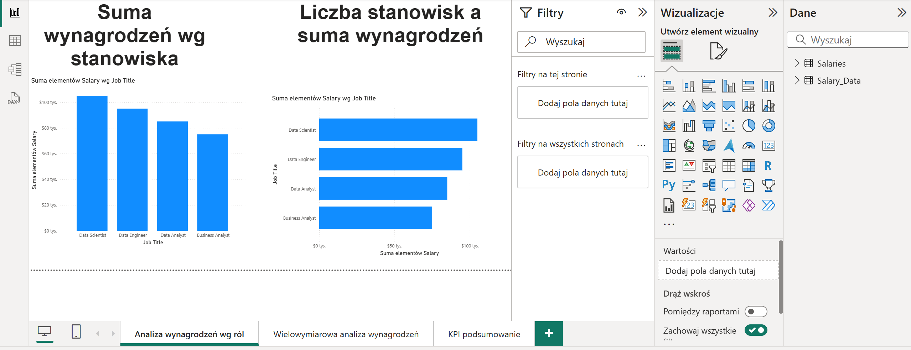
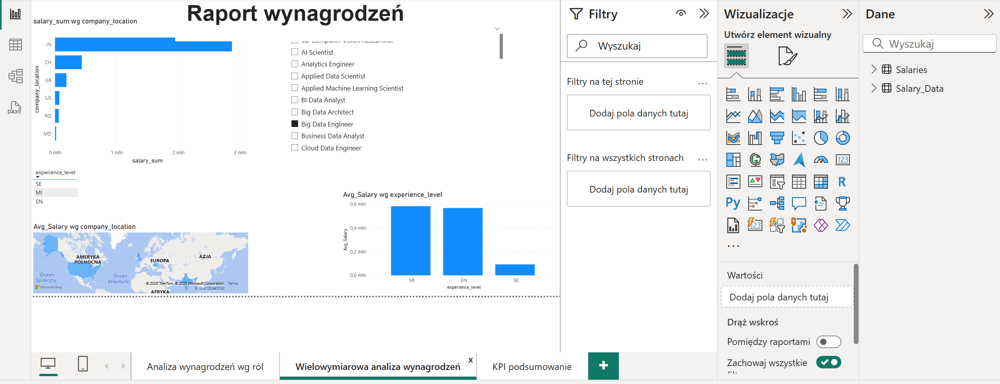
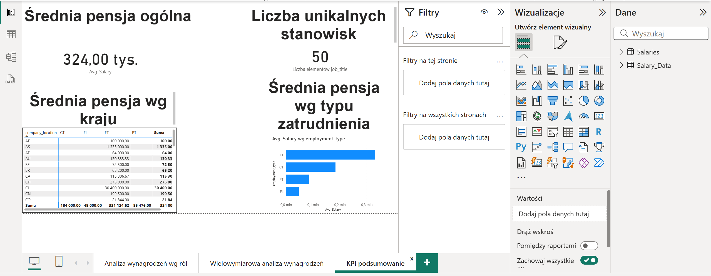

<h1 align="center">💼 Power BI Salary Analysis Dashboard</h1>

  📊 A clean and interactive Power BI report for analyzing global salary trends across roles, countries, and work settings. 
  ✨ Built to showcase Power BI storytelling and data exploration techniques.

  
  
  
  

---

## 🚀 Overview

This project is designed for:
- 📈 HR Analysts  
- 💼 Recruiters  
- 🧑‍💻 Job Seekers  

who want to understand how salaries vary across roles, countries, experience levels, and employment types.

---

## 🧩 Features

✅ Multi-page Power BI report  
✅ Drill-through enabled (click roles to see detailed views)  
✅ Dynamic filtering by:
- 🌍 Country
- 👩‍💼 Employment Type
- 📊 Experience Level
- 🏢 Work Setting (Remote / Hybrid / On-site)

✅ Calculated DAX metrics (average, median, counts)  
✅ Clean layout with responsive visuals

---

## 🖼️ Dashboard Previews

### 📌 Salary by Job Title

  

---

### 🌍 Multivariate Salary Analysis

  

---

### 📈 KPI Summary

  

---

## 🛠️ Getting Started

1. 📥 Download the `.pbix` file  
2. 🖥️ Open with [Power BI Desktop](https://powerbi.microsoft.com/desktop/)  
3. 🧪 Explore and interact with the report visuals  
4. 🔄 *(Optional)* Connect your own data  

---

## 📁 Project Structure

